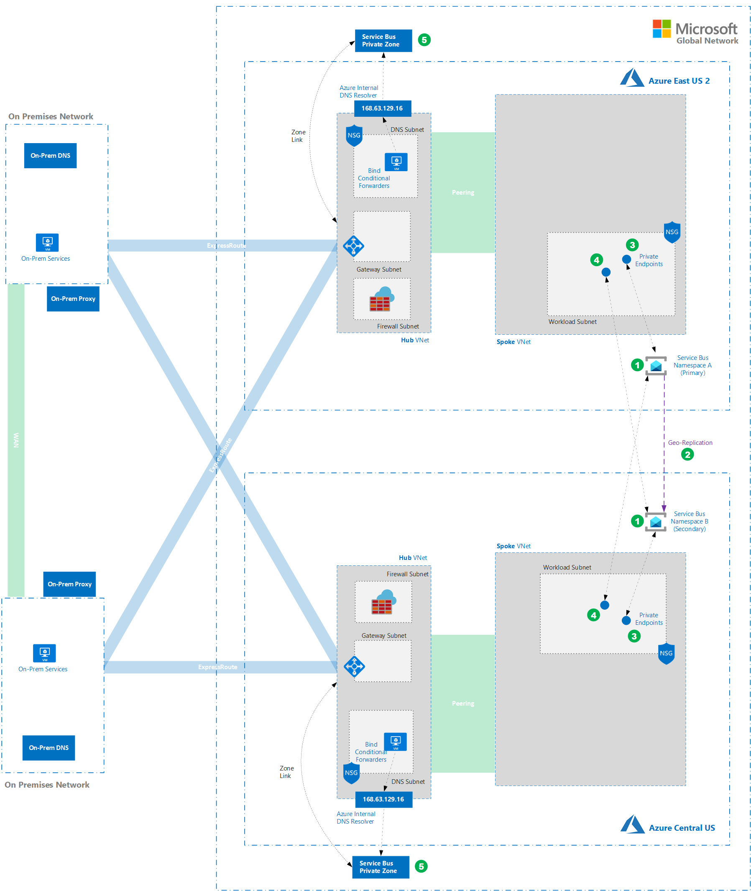

# Serverless Producer / Consumer Pattern in a Locked Down Network
Many cloud native applications are expected to handle a large number of requests. Rather than process each request synchronously, a common technique is for the application to pass them through a messaging system to another service (a consumer service) that handles them asynchronously. This strategy helps to ensure that the business logic in the application isn't blocked while the requests are being processed. For full details on this pattern see the [following article](https://docs.microsoft.com/en-us/azure/architecture/patterns/competing-consumers).

On Azure, the primary enterprise messaging service is [Azure Service Bus](https://docs.microsoft.com/en-us/azure/service-bus-messaging/service-bus-messaging-overview).

[Azure Functions](https://docs.microsoft.com/en-us/azure/azure-functions/#:~:text=Azure%20Functions%20Documentation.%20Azure%20Functions%20is%20a%20serverless,code%20in%20response%20to%20a%20variety%20of%20events.) offers a convenient compute platform from which to implement a producer consumer pattern with relatively little underlying infrastructure management.

Azure Functions and Service Bus are relatively simple to get up and running in their default configurations. Things get significantly more complex when implementing them in environments with stringent security requirements that dictate more aggressive network perimeter security and segmentation.
  
This document explains key considerations for deploying Azure Functions alongside Service Bus in a fully locked down environment using technologies including regional VNet Integration for functions, private endpoints for Service Bus and a variety of network security controls including Network Security Groups and Azure Firewall.

We will also provide composable deployment artifacts and guidance on how to achieve redundancy across multiple regions while retaining the same security posture.
## TOC
- [Pre-Reqs](Pre-Reqs)
- [Architecture](#Architecture)
- [Scalability Considerations](#Scalability-Considerations)
- [High Availability Considerations](#High-Availability-Considerations)
- [Disaster Recovery](#Disaster-Recovery)
- [Security Considerations](#Security-Considerations)
- [Observability Considerations](Observability-Considerations)
- [Cost Considerations](#Cost-Considerations)
- [DevOps Considerations](#DevOps-Considerations) 
## Pre-Reqs
In order to deploy examples in this article you will need:
- An Azure Subscription and an account with Contributor level access
- Access to a Bash (Linux machine or WSL on Windows)
- Access to Azure DevOps (if you choose to impliment any of the pipelines)
## Architecture
### Virtual Network Foundation
#### Implementation

This guide assumes that you are deploying your solution into a networking environment with the following characteristics:

- [Hub and Spoke](https://docs.microsoft.com/en-us/azure/cloud-adoption-framework/ready/azure-best-practices/hub-spoke-network-topology)  network architecture.   

- The hub VNet (1) is used for hosting shared services like Azure Firewall, DNS forwarding and providing connectivity to on-premises networks. In a real implementation, the hub network would be connected to an on-premises network via ExpressRoute, S2S VPN, etc (2). In our reference examples we'll, exclude this portion of the architecture for simplicity.  

- The spoke network (3) is used for hosting business workloads. In this case we're integrating our Function App to a dedicated subnet ("Integration Subnet") that sits within the spoke network. We'll use a second subnet ("Workload Subnet") for hosting other components of the solution including private endpoints for our Service Bus namespaces, etc.  

- The Hub is peered to Spoke using Azure VNet Peering.  

- In many locked down environments [Forced tunneling](https://docs.microsoft.com/en-us/azure/vpn-gateway/vpn-gateway-forced-tunneling-rm) is in place. E.G. routes are being published over ExpressRoute via BGP that override the default 0.0.0.0/0 -> Internet system route in all connected Azure subnets. The effect is that there is **no** direct route to the internet from within Azure subnets. Internet destined traffic is sent to the VPN/ER gateway. We can simulate this in a test environment by using restrictive NSGs and Firewall rules to prohibit internet egress. We'll route any internet egress traffic to Azure firewall (4) using a UDR where it can be filtered and audited.  

- Generally, custom DNS is configured on the spoke VNet settings. DNS forwarders in the hub are referenced. These forwarders  provide conditional forwarding to the Azure internal resolver and on premises DNS servers as needed. In this reference implementation we'll deploy a simple BIND forwarder (5) into our hub network that will be configured to forward requests to the Azure internal resolver. 
#### Deploy
1. Create a resource group for each region's network resources
	```
	az group create --location eastus2 --name network-eastus2-rg  

	az group create --location centralus --name network-centralus-rg
	```
2. Deploy the base VNets and Subnets to both regions ([ARM Template](templates/base-network/azuredeploy.json)) todo: make non-overlapping
	```
	az deployment group create --resource-group network-eastus2-rg --name network-eastus2 --template-file .\templates\base-network\azuredeploy.json --parameters hubVnetPrefix="10.0.0.0/16" firewallSubnetPrefix="10.0.1.0/24" DNSSubnetPrefix="10.0.2.0/24" spokeVnetPrefix="10.1.0.0/16" workloadSubnetPrefix="10.1.2.0/24"

	az deployment group create --resource-group network-centralus-rg --name network-centralus --template-file .\templates\base-network\azuredeploy.json --parameters hubVnetPrefix="10.2.0.0/16" firewallSubnetPrefix="10.2.1.0/24" DNSSubnetPrefix="10.2.2.0/24" spokeVnetPrefix="10.3.0.0/16" workloadSubnetPrefix="10.3.2.0/24"
	
	```
3. Deploy and configure Azure Firewall in both regions ([ARM Template](templates/firewall/azuredeploy.json))
	```
	az deployment group create --resource-group network-eastus2-rg --name firewall-eastus2 --template-file .\templates\firewall\azuredeploy.json --parameters  networkResourceGroup=network-eastus2-rg vnetName=hub-vnet subnetName=AzureFirewallSubnet
	
	az deployment group create --resource-group network-centralus-rg --name firewall-centralus --template-file .\templates\firewall\azuredeploy.json --parameters networkResourceGroup=network-centralus-rg vnetName=hub-vnet subnetName=AzureFirewallSubnet
	```
4. Deploy BIND DNS forwarders in both regions ([ARM Template](templates/bind-forwarder/azuredeploy.json))
	```
	az deployment group create --resource-group network-eastus2-rg --name bind-eastus2 --template-file .\templates\bind-forwarder\azuredeploy.json --parameters adminUsername=$userName sshKeyData=$sshKey vnetName=hub-vnet subnetName=DNSSubnet
	
	az deployment group create --resource-group network-centralus-rg --name bind-centralus --template-file .\templates\bind-forwarder\azuredeploy.json --parameters adminUsername=$userName sshKeyData=$sshKey vnetName=hub-vnet subnetName=DNSSubnet
	```
6. Deploy and Configure the Integration Subnet for Regional VNet Integration for both regions ([ARM Template](templates/integration-subnet/azuredeploy.json))
	```
	az deployment group create --resource-group network-eastus2-rg --name integration-eastus2 --template-file .\templates\integration-subnet\azuredeploy.json --parameters existingVnetName=spoke-vnet integrationSubnetPrefix="10.1.6.0/24"
	
	az deployment group create --resource-group network-central-rg --name integration-centralus --template-file .\templates\integration-subnet\azuredeploy.json --parameters existingVnetName=spoke-vnet integrationSubnetPrefix="10.3.6.0/24"
	```

[top ->](#TOC)    
### Azure Service Bus
#### Requirements
- Predictable / Consistent Performance
- Direct integration to and accessibility from private networks
- No accessibility from public networks

#### Implementation
  
The base-level resource for Azure Service Bus is a Service Bus Namespace. Namespaces contain the entities that we will be working with ( Queues, Topics and Subscriptions ).

When creating a namespace in a single region, there are relatively few decisions you'll need to make. You will need to specify the name, pricing tier, initial scale and redundancy settings, subscription, resource group and location.

In our reference implementation we will be deploying a Premium namespace. This is the tier that is recommended for most production workloads due to it's performance characteristics. In addition, the Premium tier supports VNet integration which allows us to isolate the namespace to a private network. This is key to achieving our overall security objectives.   
  
- We'll create a namespace A in East US 2 (1)  

- The namespace will be set up with a private endpoint (2) in the spoke workload subnet. We will configure access restrictions (per-namespace firewall) on the namespace such that the endpoint will be the only method one can use to connect to the namespace. This effectively takes the namespace off the internet.  

- A private DNS zone (3), requisite A record and VNet link will be created such that queries originating from any VNet that is configured to use our central DNS server will resolve the namespace name to the IP of the private endpoint and not the public IP. This is done via split horizon DNS. E.G. externally, the namespace URLs will continue to resolve to the public IP's which will be inaccessible due to the access restriction configuration. Internally the same URLs will resolve to the IP of the private endpoint.    
#### Deploy
1. Create the Namespace
	```
	```
2. Enable Private Link
	```
	```
3. Link the Private DNS Zone
	```
	```
4. Create a test queue and topic
	```
	```
___
[Deploy steps 1-4 in one step.](link_url)
___
[top ->](#TOC) 

### Azure Functions Producer / Consumer
#### Requirements
##### Messaging
- All Entities must be available in both regions
- Must be able to continue processing of messages that are in the messaging store but have yet to be processed when failover occurs.
##### Functions
- All Entities must be available in both regions
- Must be able to continue processing of messages that are in the messaging store but have yet to be processed when failover occurs.
#### Implementation
#### Deploy
1. tbd
	```
	```
2. tbd
	```
	```
3. tbd
	```
	```
4. tbd
	```
	```
___
[Deploy steps 1-4 in one step.](link_url)
___
[top ->](#TOC)  
## Scalability Considerations
## High Availability Considerations
## Disaster Recovery
### Functions and Service Bus
#### Requirements
#### Implementation

#### Deploy
### Networking

## Security Considerations
## Observability Considerations
## Cost Considerations
## DevOps Considerations


