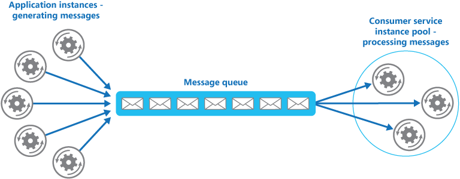
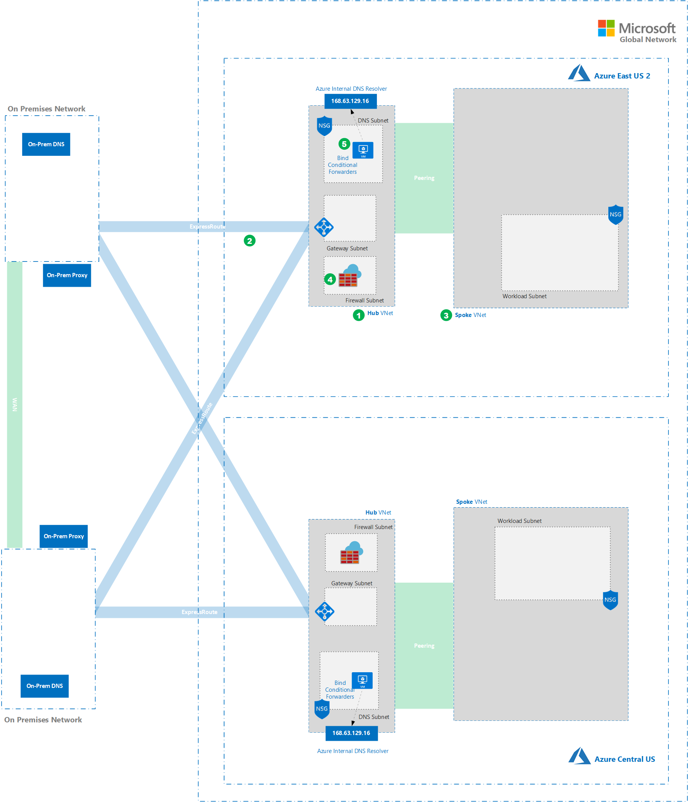

# Serverless Producer / Consumer Pattern in a Locked Down Network

An application running in the cloud is expected to handle a large number of requests. Rather than process each request synchronously, a common technique is for the application to pass them through a messaging system to another service (a consumer service) that handles them asynchronously.This strategy helps to ensure that the business logic in the application isn't blocked while the requests are being processed. For full details on this pattern see the [following article](https://docs.microsoft.com/en-us/azure/architecture/patterns/competing-consumers).


On Azure, the primary enterprise messaging service is Azure Service Bus. Azure Functions offers a convenient compute platform from which to implement a producer consumer pattern with relatively little underlying infrastructure management.

Azure Functions and Service Bus are relatively simple to get up and running in their default configurations. Things get significantly more complex when integrating them into private networks where the flow of traffic is constrained.
  
This document explains key considerations for deploying Azure Functions alongside Service Bus in a fully locked down environment using technologies including regional VNet Integration for functions, private endpoints for Service Bus and a variety of network security controls including Network Security Groups and Azure Firewall. It also goes into detail on how to achieve redundancy across multiple regions.

## TOC

- [Architecture](#Architecture)
- [Recommendations](#Recommendations)
- [Scalability Considerations](@Scalability-Considerations)
- Availability Considerations
- Security Considerations
- Cost Considerations
- DevOps Considerations
- Deploy the Solution

[top ->](#TOC)  
## Architecture
### Virtual Network Foundation

This guide assumes that you are deploying a solution into a networking environment with the following characteristics:

- [Hub and Spoke](https://docs.microsoft.com/en-us/azure/cloud-adoption-framework/ready/azure-best-practices/hub-spoke-network-topology)  network architecture. 
- The hub VNet (1) is used for hosting shared services like Azure Firewall and providing connectivity to an on-premises networks. In a real implementation, the hub network would be connected to an on-premises network via ExpressRoute, S2S VPN, etc (2). In our test environment, we will leave this out.
- The spoke network (3) is used for hosting business workloads. In this case we're integrating our Function App to a dedicated subnet ("Integration Subnet") that sits within the spoke network. We'll use a second subnet ("Workload Subnet") for hosting other components of the solution.
- The Hub is peered to Spoke.
- In many locked down environments [Forced tunneling](https://docs.microsoft.com/en-us/azure/vpn-gateway/vpn-gateway-forced-tunneling-rm) is in place. E.G. routes are being published over ExpressRoute via BGP that override the default 0.0.0.0/0 -> Internet system route in all connected Azure subnets. The effect is that there is **no** direct route to the internet from within Azure subnets. Internet destined traffic is sent to the VPN/ER gateway. We can simulate this in a test environment by using restrictive NSGs and Firewall rules to prohibit internet egress. We'll route any internet egress traffic to Azure firewall (4) where it can be filtered and audited.
- Generally, custom DNS is configured on the spoke VNet. DNS forwarders in the hub are used to provide conditional forwarding to the Azure internal resolver and on premises DNS servers as needed. In this reference implementation we'll deploy a simple BIND forwarder (5) into our hub network that will be configured to forward requests to the Azure internal resolver. This will allow us to simulate custom DNS.
### Azure Service Bus
### Azure Functions Producer / Consumer


### Deploy
- Create a resource group
	```
	```
- Deploy the base VNets and Subnets
	```
	```
- Deploy and Configure the Integration Subnet for Regional VNet Integration
	```
	```
- Deploy and configure Azure Firewall
	```
	```

[top ->](#TOC)  

## Deploy Functions and Service Bus in a Single Region
### Deploying Service Bus
#### Requirements
- Service Bus Namespace must have redundancy within a single region to achieve a 99.9% uptime SLA
- The Service Bus Namespace must only be accessible through a private endpoint running within an RFC 1918 network. E.G. no access should be granted from Internet routable addresses.
- Deployment must be fully automated and accommodate namespace and entity creation and configuration.
#### Deploy
- Create Resource Group
	```bash
	az group create --name $resourceGroup1Name --location $resourceGroup1Location
	```
- Deploy Namespace ([ARM Template](templates/service-bus/azuredeploy-namespace.json))
	```bash
	az deployment group create --name primaryns --resource-group $resourceGroup1Name --template-file azuredeploy-namespace.json --parameters namespaceName=$namespace1Name
	```
- Create Entities ([ARM Template](templates/service-bus/azuredeploy-queuestopics.json))
	```
	az deployment group create --name queuestopics --resource-group $resourceGroup1Name --template-file azuredeploy-queuestopics.json --parameters namespaceName=$namespace1Name
	```
- Configure Private Link and Private DNS Zones ([ARM Template 1](templates/service-bus/azuredeploy-privatelink.json)), ([ARM Template 2](templates/service-bus/azuredeploy-zonelink.json))
	```
	az deployment group create --name centralusep1 --resource-group $resourceGroup2Name --template-file azuredeploy-privatelink.json --parameters namespaceName=$namespace2Name privateEndpointName=CentraltoCentral privateDnsZoneName=privatelink.servicebus.windows.net vnetName=spoke-vnet subnetName=workload-subnet networkResourceGroup=$centralNetworkResourceGroupName primary=false


	az deployment group create --name centralusep2 --resource-group $resourceGroup2Name --template-file azuredeploy-privatelink.json --parameters namespaceName=$namespace1Name privateEndpointName=CentraltoEast privateDnsZoneName=privatelink.servicebus.windows.net vnetName=spoke-vnet subnetName=workload-subnet networkResourceGroup=$centralNetworkResourceGroupName primary=false
	```

[top ->](#TOC)
### Deploy A Function App
#### Requirements
- Windows App Service Plan
- Node JS Language
- Functional Monitoring via AppInsights
- Regional VNet Integration
- All egress via VNet Integration
- Support for Service Bus Trigger  

#### Deployment Steps
- Deploy an App Service Plan
	```
	```
- Configure the Function App's Storage Account
	```
	```
- Enable Regional VNet Integration
	```
	```
- Force All Traffic down Regional VNet Integration
	```
	```

## Expand to a second region for Redundancy
### Service Bus
### Function Apps


## Networking Walk-Through (Single Region)

### Producer Flow
1. A producer application (1) in the Workload Subnet is set up to send messages to a Service Bus Queue running in Namespace A (2).  

2. Namespace A (2) has been configured with a private endpoint so that it is only accessible via a private endpoint (6). E.G. there is no Internet facing access to this namespace.  

3. When the producer application (1) connects to the Namespace (2), it first issues a DNS query to obtain the namespace's IP address.  

4. The VNet that the producer application (1) is running in has been configured with a custom DNS setting that causes VMs running in that VNet to use a DNS forwarder (3) in the Hub VNet for DNS resolution.  

5. The DNS forwarder is set up to forward queries for private zones to the internal resolver (4). The internal resolver (4) returns the IP address of the private endpoint (6) instead of the public IP for the namespace as the VNet it's running in has been linked to a private zone (5) specifically configured for Private Link on Namespace A (2) .  

6. Now that the app (1) has the private endpoint (6) IP, it is able to connect to the Service Bus Queue in Namespace A (2) so that it can send messages.  

### Consumer Flow
1. A consumer function (7) is running in an App Service Plan. It is configured with Regional VNet Integration and is connected to a integration subnet (8) in the Spoke VNet. All egress from the function is sent down the VNet integration using the WEBSITE_VNET_ROUTE_ALL application setting.  

2. Code running in the function is set up to use a Service Bus trigger and is constantly polling the Service Bus Queue in the namespace (2).  

3. When connecting to the queue, the function first needs to issue the same DNS query that the producer app issued. The query for the namespace IP is sent down the Regional VNet integration (8) and into the integration subnet.  

4. The VNet that the function has been integrated into is configured with a custom DNS entry that causes the function to send it's DNS query to the fowarder in the hub (3).  

5. The DNS forwarder is set up to forward queries for private zones to the internal resolver (4). The internal resolver (4) returns the IP address of the private endpoint (6) instead of the public IP for the namespace as the VNet it's running in has been linked to a private zone specifically configured for Private Link on Service Bus (5).   

6. Now that the function app (7) has the private endpoints (6) IP it is able to connect to the Service Bus Queue in Namespace A (2) through the Regional VNet integration (8) and private endpoint (6) to read messages when they arrive.  

### Monitoring Setup

It's best to get monitoring working before we start deploying functions. The functions host will be instrumented with App Insights by default. Connectivity to App Insights however will be broken in this architecture until we give the function host which is running on the function app a path to the public App Insights endpoints. In the future we can solve this problem by using a private endpoint for Azure Monitor. Today however we need to filter this traffic with Azure Firewall.

1. Deploy Azure Firewall into the Hub VNet. Firewall needs to go into a subnet called AzureFirewallSubnet.  

2. Create a User Defined Route (UDR) w/ a route sending address prefix 0.0.0.0/0 to next hop of type "Virtual Appliance" referencing the internal IP of the firewall.  

3. Assign the route to the integration subnet.  

4. Add a new outbound rule to "integration-subnet-nsg" to allow VirtualNetwork to the service tag of AzureMonitor on port 443. Make it priority 498.  

5. Set up application rules for rt.services.visualstudio.com on 443, dc.services.visualstudio.com on 443. These are the public App Insights endpoints that code running in the function host will try to hit when it sends telemetry.  

6. Make sure that you have an NSG rule to allow outbound traffic out of the integration subnet. You can reference the AzureMonitor service tag as a destination. Use 443 as a destination port. 

[top ->](#TOC)  

## Cross-Region redundancy for non-HTTP functions triggering on Service Bus

1. Service Bus itself will be setup for Geo Replication across two regions. This causes the primary namespace entities ( no data ) to be replicated to a secondary namespace. In this example we're replicating From Namespace A in East US 2 to Namespace B in Central US.  

2. Producer apps send messages to the Primary Namespace ( Namespace A to start ) using a DNS alias that is specified when geo-replication is configured. This is a literal DNS alias that redirects clients to Namespace A's DNS name.  

3. Consumer Applications are set up to connect to the primary and secondary namespace directly in each region. This create an active / passive setup for consumers in which the consumers in the secondary region are effectively watching a queue that has an identical set of entities to the primary namespace but zero messages under normal operating conditions.

4. In the case of a failure, the Namespaces are failed over. At this time, the alias is automatically re-pointed to Namespaces B's DNS name.  

5. Messages coming in through producers begin to flow into Namespace B in Central US which is now the primary namespace.

6. Consumers in Central US now begin picking up messages from Namespace B.


## Networking Walk-Through (Cross-Region Redundancy)

